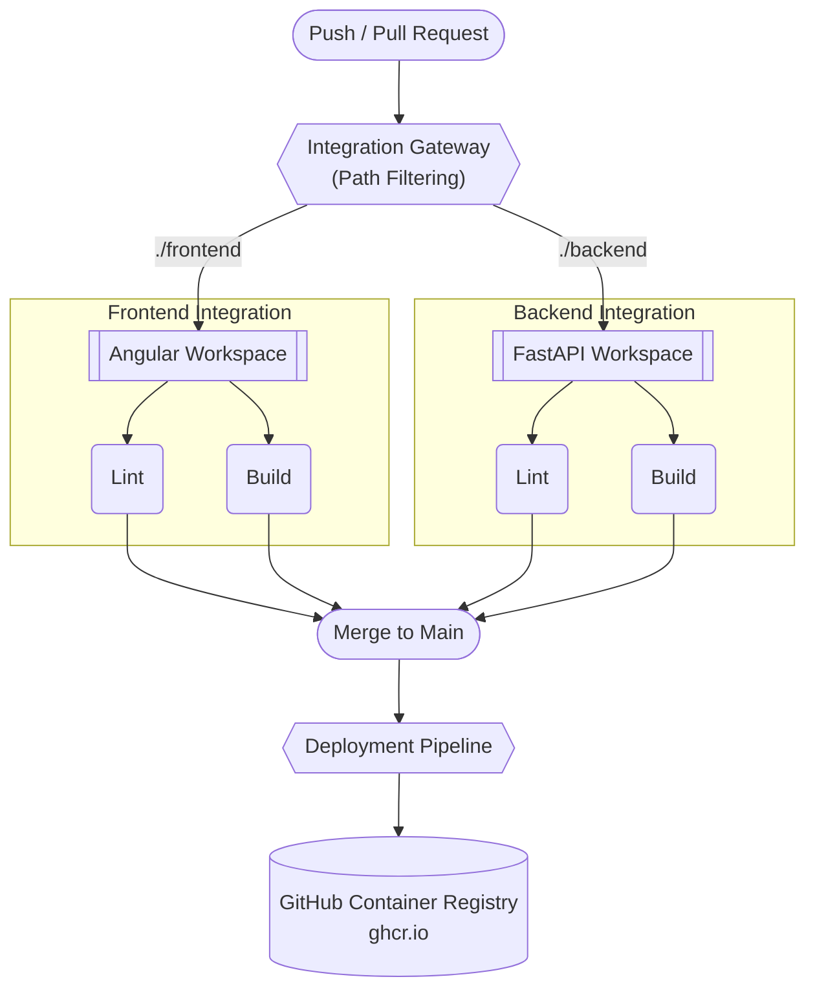

# Multi-Agent Web Application
This project is a multi-agent system that optimally assigns employees to workplace roles while respecting role budgets and preventing duplicate assignments. It solves the problem by decomposing it into parallel knapsack optimization tasks, combining dynamic programming, genetic algorithms simulated annealing, search, and backtracking to find high-quality team allocations.

## Tech Stack
- **Frontend:** Angular, Angular Material, TypeScript, HTML, SCSS
- **Backend:** FastAPI, Python
- **Data**: JSON

## Project Structure
- `/frontend` - Frontend Angular application (see [Frontend README](./frontend/README.md) for local setup)
- `/backend` - Backend FastAPI API (see [Backend README](./backend/README.md) for local setup)

## Quick Start
1. Clone the repository.
2. Follow the setup guides in the `/frontend` and `backend` folders.

## CI/CD Pipeline Architecture
This repository implements an automation workflow using **GitHub Actions**. The pipeline is designed around a **Modular Gateway Architecture**

### Workflow Overview

### Pipeline Components

| Workflow | Path | Trigger Condition | Primary Responsibilities |
| :--- | :--- | :--- | :--- |
| **Integration Gateway** | `.github/workflows/integration-gateway.yml` | Every Pull Request & Push | Intercepts events, evaluates modified paths, and dynamically triggers required sub-pipelines. |
| **Frontend Integration** | `.github/workflows/frontend.yml` | Triggered by Gateway | Spawns parallel jobs to lint TypeScript/HTML files and compile the production build (`ng build`) independently. |
| **Backend Integration** | `.github/workflows/backend.yml` | Triggered by Gateway | Spawns parallel jobs to run Python linting tools and compile/verify the application inside an isolated test environment. |
| **Deployment** | `.github/workflows/deployment.yml` | Automated Merge to `main` | Packages the verified FastAPI and Angular apps into optimized production **Docker** images and publishes them to **GHCR**. |
